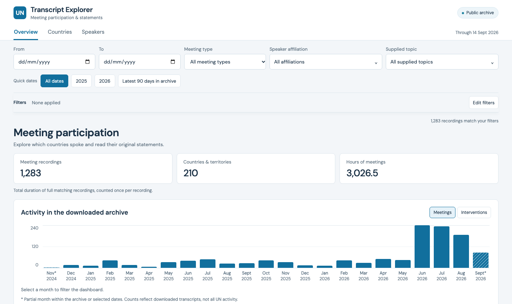

# UN Transcript Explorer

UN meeting transcripts are difficult to search across speakers, countries, and topics. This explorer turns 1,283 English recordings and 95,395 interventions into a browsable archive where you can filter meetings, compare country participation, and read the original transcript text. [Open the live explorer](https://henrisalomon.github.io/un-transcript-explorer/).



The snapshot reflects the archive exported on 22 September 2026; counts change when the data is refreshed. React and TypeScript render the static site, while a Web Worker filters the index and loads full text only when a recording is expanded.

## Local development

```sh
npm ci
npm run dev
```

The generated `public/data` snapshot is included, so a fresh checkout can run without the original archive. The archive remains outside this dashboard repository.

## Manual data refresh

From the parent archive directory, run the existing downloader first. Then, inside this directory:

```sh
npm run export:data
npm test
python3 -m unittest discover -s tests -p 'test_*.py'
npm run build
```

The exporter reads `../data`, validates one transcript at a time, and replaces the generated snapshot only after completion. Invalid files are listed in `manifest.json`; they are not included in totals. A failed export preserves the previous snapshot. Publish the successful build through Sites using the existing project in `.openai/hosting.json`. Do not create a new Site on refresh. Publication is manual; no scheduler is configured.

## Counts and identity

- One canonical source slug equals one recording; multipart recordings count separately.
- Affiliation identifiers come from source codes when present, otherwise the normalized full label. Names and labels are normalized for whitespace/case only. No fuzzy identity inference.
- A speaker is a normalized name plus affiliation. Nameless interventions stay in affiliation and country profiles but do not become invented people.
- Country recognition uses ISO 3166-1 codes, independent of map geometry. Small countries remain in the country list. Organizations and missing affiliations are never assigned a country by inference.
- Topic identities use the supplied key and label pair. Topics match on the intervention where they occur. No new topics or model classification are generated.
- Date/type/affiliation/topic filters combine with AND at intervention level. Distinct recordings and profiles use those same matches.
- Country and affiliation profiles include chairs' procedural speech. Roles are displayed, not inferred.
- Newest meetings sort by source date, scheduled time, and stable source ID. Statements within meetings sort by recording timestamp and source order.

## Filter shortcuts

Quick dates offers All dates, the latest two calendar years represented in the archive, and Latest 90 days in archive. The 90-day window includes the archive's latest date and is clipped to the archive start when needed. Presets change only the date bounds. The sticky filter summary has individually removable date, meeting-type, affiliation, topic and active speaker-search chips; Clear all resets filters while preserving the current page/view context and sort. Filter changes reset result pagination, and the existing URL state supports reload and browser history. Edit filters scrolls back to the controls and focuses the start date.

## Overview charts

The Hours of meetings card sums source-provided video durations once per matching recording and displays decimal hours. These are full recording lengths, including when a topic or affiliation selects only some interventions. Unavailable durations are explicitly excluded and reported; they are never estimated from transcript timestamps.

Monthly activity counts distinct recordings under the active filters. Zero-activity months remain visible. Boundary months clipped by the archive or selected dates are marked as partial. Selecting a month sets the date range; Reset dates preserves other filters. Counts describe the downloaded archive, not complete UN activity.

The ranked country bars and map colours show distinct matching recordings only. Hovering or focusing a mapped country shows its meeting count and share of all filtered meetings. Countries can appear in the same recording, so these shares are not additive. Country profiles retain their meeting-type breakdown above the meeting list.

## Data files

`manifest.json` points to a content-hashed index containing metadata dictionaries and compact statement rows. The row fields, in order, are meeting index, statement ordinal, speaker index (-1 if absent), affiliation index, start seconds, topic indices, role, and source statement number. Content-hashed `text/*.json` files contain arrays of statement text in source order, preserving paragraph breaks. Deploy the index and text snapshot together.

## Verification

`npm test` checks count and filter semantics, profile membership, small countries, unknown filters, same-day chronology, dictionary integrity and full-archive performance. Python tests check exporter normalization, preserved original text, and recovery from invalid input. `npm run build` type-checks and creates `dist/`.

World geometry: @d3-maps/atlas 1.0.0, countries-110m, supplied as TopoJSON. The map is for navigation and does not assert official UN boundaries. Transcripts are automatic recognition outputs, including interpreted speech, and are not official UN records.

## Countries tab

The Countries tab compares distinct recordings per month, recording counts or percentages by meeting type, and shared participation for a selected pair. The selection includes all five permanent Security Council members plus the five highest-ranked other countries under the active filters; ties use country name. P5 countries with no matches remain visible at zero. Monthly gaps are zero-filled and partial boundary months are marked. Tables provide exact chart values and country profiles link to statements.

Shared participation uses recordings with matching interventions attributed to both countries. The overlap percentage is the intersection divided by the union. “Only” is relative to the selected pair and does not exclude other countries. All date, meeting-type, affiliation and topic filters apply before counting; this is participation, not attendance or agreement.
